# Ride-Sharing Management

## Authors:
* Arthur Silva - 1180842
* Ivo Macieira - 1170554
* Francisco Andrade - 1181477
* Diogo Silva - 1161752
* José Magalhães - 1180852
* Kevin Sousa - 1180853

# 1. Introduction

This report aims to explain our approach, work methodology and conclusion. 

The application's objective is to support a ride-sharing businesses by managing users, vehicles, parks, trips, invoices and receipts

The development languages used were Java and Oracle SQL*Plus. SQL scripts can be found inside the folder "Modelo Relacional\Script".

# 2. Resolution

## 2.1. The application
Users can pickup vehicles at designated parks and return them at a different parking locations. This application manages users, bicycles, electric scooters, parks and trips.

**Domain Model**

**Relational Model**

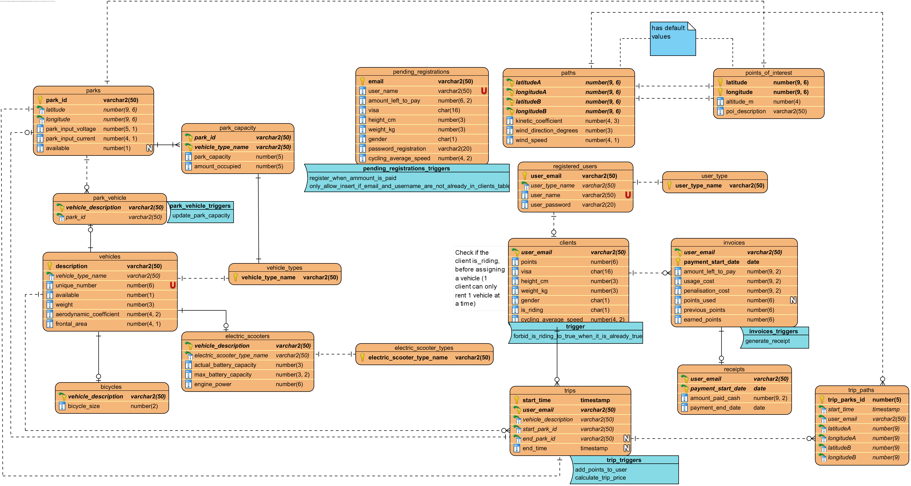

## 2.2. Use Cases

### 2.2.1. Get the most efficient route between two parks (at least a certain number of interest points)

**Use case diagram**

**Sequence Diagram**

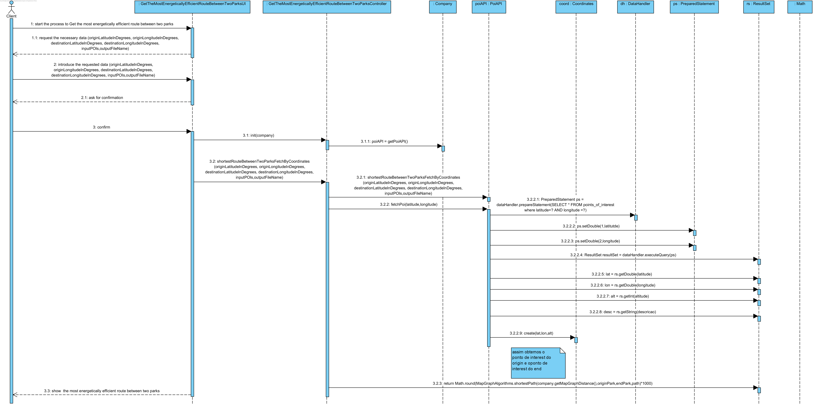)

**Class Diagram**	

**Description**

In this use case, the client is able to consult the most efficient route between two parks, passing by a certain number of points of interest. 

### 2.2.2. Fetch free slots at park by type

**Use case diagram**

**Sequence Diagram**

)

**Class Diagram**	

**Description**

In this use case, the client is able to check if a park has free slots to a specified type of vehicle.

### 2.2.3. Get uncapable scooters

**Use case diagram**

**Sequence Diagram**

)

**Class Diagram**	

**Description**

In this use case, the administrator is able to get a report stating which scooters, registered in the system, do not have enough autonomy to make a trip with a certain number of kilometers, defined by him.

### 2.2.4. Get the most energetically efficient Route between Two Parks

**Use case diagram**

**Sequence Diagram**

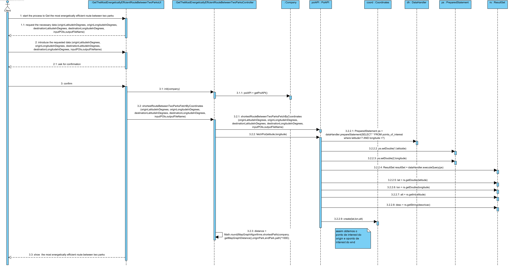

**Class Diagram**	

**Description**

In this use case, the client is able to get the most energetically efficient route between two parks. To calculate the energy that will be spent, information about the client, the vehicle and the paths that he will pass are needed, since the physic calculation needs that information.

### 2.2.5. Get the nearest park

**Use case diagram**

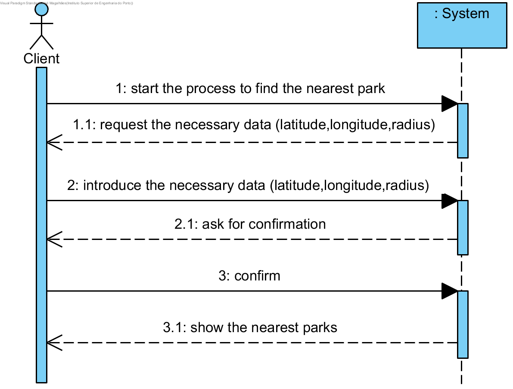

**Sequence Diagram**

**Class Diagram**	

**Description**

In this use case, the client is able to get the nearest park to him. If not specified, it is given a nearest park inside the range of 1km.

### 2.2.6. Update park

**Use case diagram**

**Sequence Diagram**

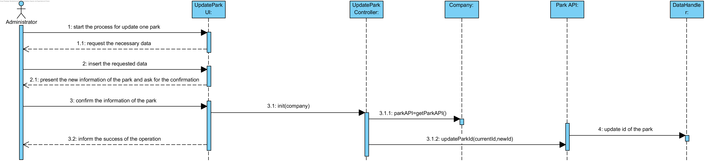

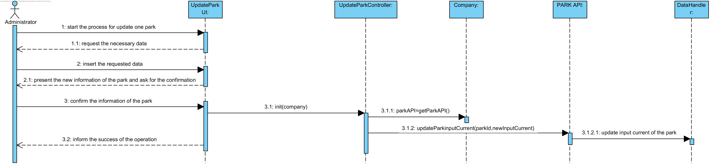
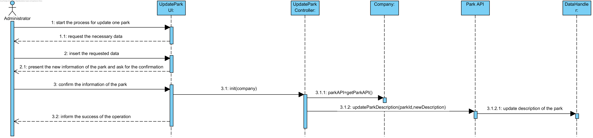

**Class Diagram**	

**Description**

In this use case, the administrator is able to update the information of a park.

### 2.2.7. Add park

**Use case diagram**

**Sequence Diagram**

**Class Diagram**	

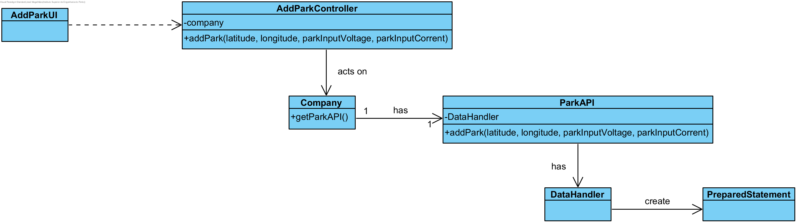

**Description**

In this use case, the administrator uses the application (Inserts a park) to register a park into the system.

### 2.2.8. Distance of a park by id

**Use case diagram**

**Sequence Diagram**

**Class Diagram**	

**Description**

In this use case, the client can obtain the distance to a given park.

### 2.2.9. Remove a park by id

**Use case diagram**

**Sequence Diagram**

**Class Diagram**	

**Description**

In this use case, the administrator can remove a park from the system, by providing the id.

### 2.2.10. Load a point of interest

**Use case diagram**

**Sequence Diagram**

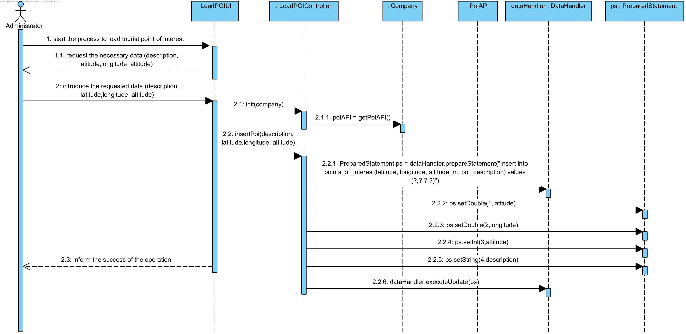

**Class Diagram**	

**Description**

In this use case, the administrator is able to load a point of interest into the system, by specifying his description, latitude, longitude and altitude.

### 2.2.11. Predict burned calories

**Use case diagram**

**Sequence Diagram**

**Class Diagram**	

**Description** 
 
In this use case the client can predict the amount of calories burnt between two parks. This will only be possible if the data about the client, the bicycle in use and the start and end parks are specified, since information like the weight and average speed of the client, the frontal area of the bicycle, the kinetic coefficient of the path, etc. This calculation will be made in the class physics calculations, that has a method that calculates the energy spent in joules, and then converts it to calories.

### 2.2.12. Return vehicle to park

**Use case diagram**

**Sequence Diagram**

**Class Diagram**	

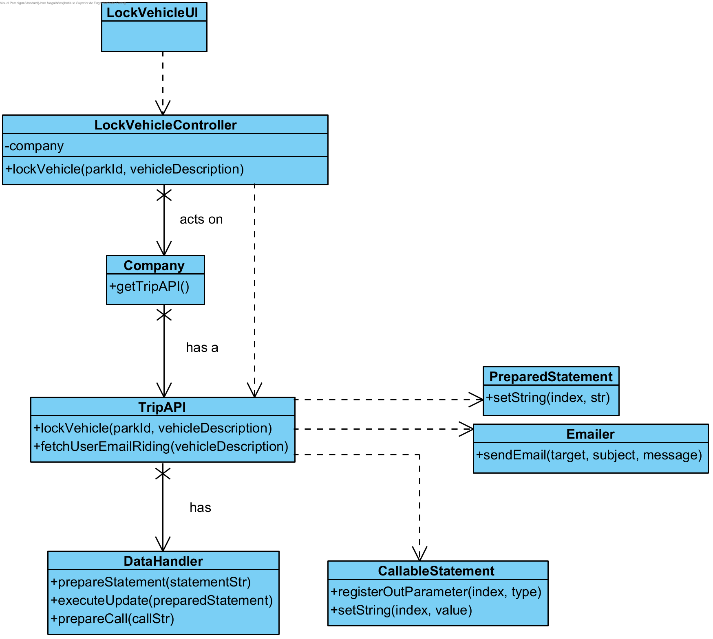

**Description**

In this use case, the client will be able to return a vehicle to a park, after making a trip. For this situation to succeed, information about the park and the vehicle description is needed. When the vehicle is successfully returned to the park, the client receives an email informing of the situation.

### 2.2.13. Get the shortest route between two parks

**Use case diagram**
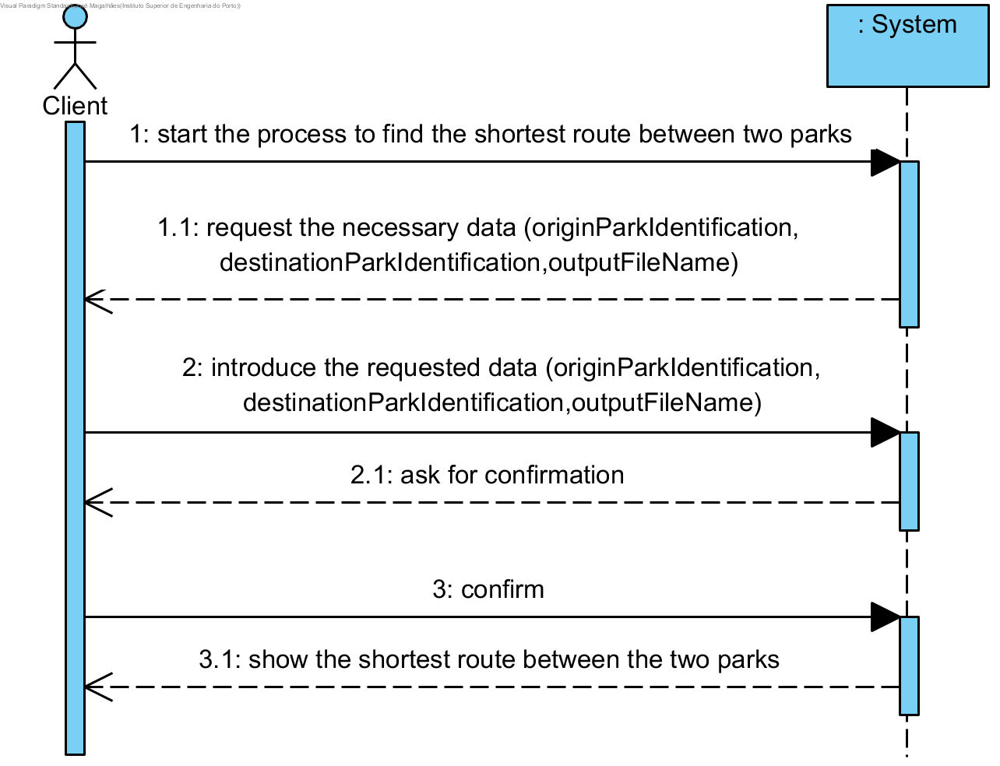

**Sequence Diagram**

**Class Diagram**	

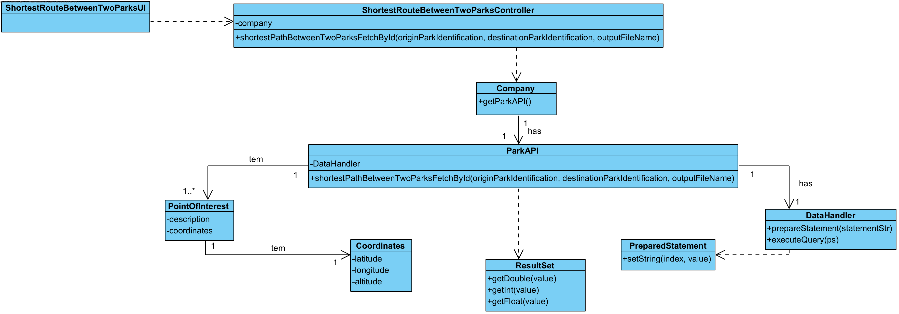

**Description**

In this use case, the client can get the shortest path between two parks. The starting and ending park must be specified for the success of this operation, along with the name of the file that will contain the information returned.

### 2.2.14. Filter scooters with autonomy

**Use case diagram**

**Sequence Diagram**

**Class Diagram**	

**Description**

In this use case, the client will be able to know the scooters with enough autonomy to make a trip. The scooters must have autonomy to make the distance, plus 10% of the distance.

### 2.2.15. Get List of vehicles not available

**Use case diagram**

**Sequence Diagram**

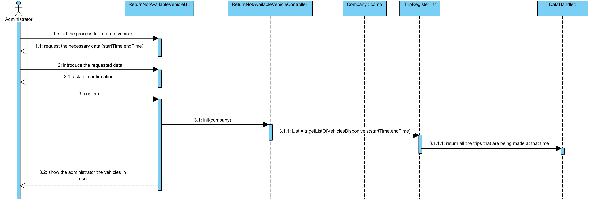

**Class Diagram**	

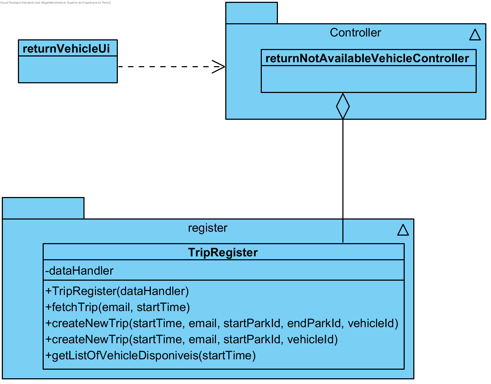

**Description**

In this use case, the administrator is able to get a list of vehicles that are not available. To get this information, he must specifie a start time and an end time. The system will then verify the vehicles not available in that period of time.

### 2.2.16. Unlock a vehicle

**Use case diagram**

**Sequence Diagram**

**Class Diagram**	

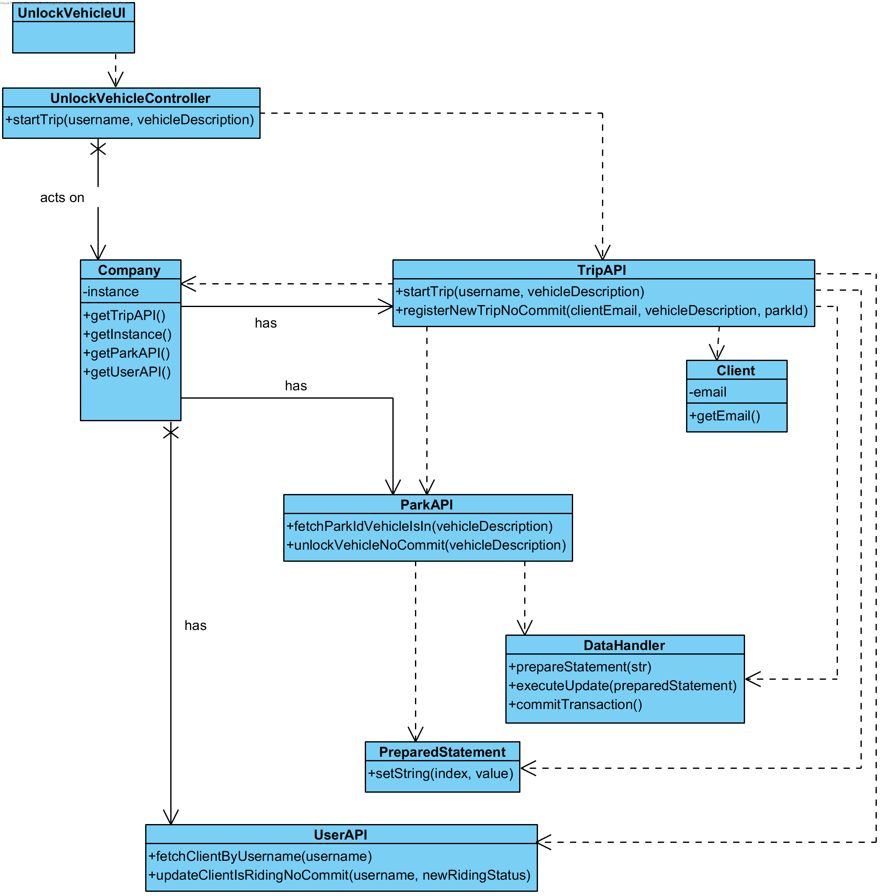

**Description**

In this use case, the client will be able to unlock a vehicle. The system requests his username and the vehicle description, so that the client and the vehicle are identified. Having this, if the vehicle is not already unlocked, the operation is a success. 

### 2.2.17. Register a user

**Use case diagram**

**Sequence Diagram**

**Class Diagram**	

**Description**

In this use case, a non registered user can register on the system. He must provide information about him (name, email, gender, height, etc). If he does not insert invalid data, the operation is a success, and the person is now registered in the system.

### 2.2.18. Register vehicles

**Use case diagram**

**Sequence Diagram**

**Class Diagram**	

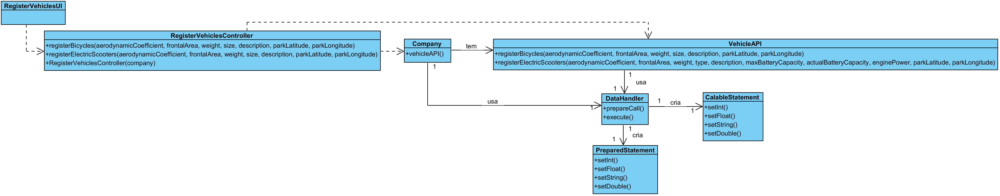

**Description**

In this use case, an administrator can register a new vehicle in the system. This vehicles can be bicycles or electrical scooters. Some requested data will be different according to the vehicle type. If the operation is a success, a new vehicle is registered in the system.

### 2.2.19. Vehicles Available at a given park

**Use case diagram**

**Sequence Diagram**

**Class Diagram**	

**Description**

In this use case, a client can consult the vehicles available in a specified park. To inform which park he wants to consult, the client can insert the park id or the coordinates that is located.

## 2.2.20. Retrieve park charging report

**Use case diagram**

**Sequence Diagram**

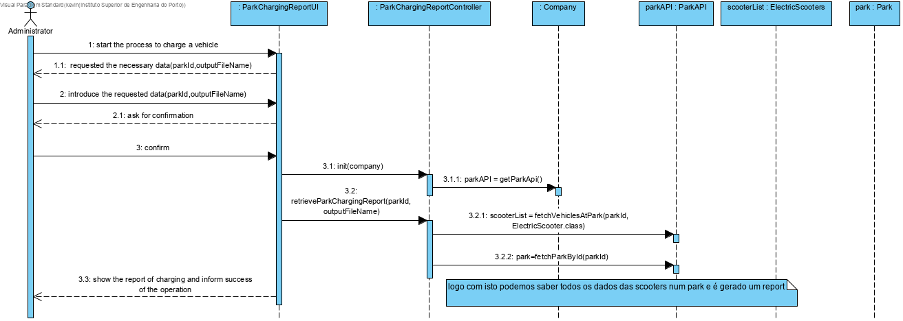

**Class Diagram**	

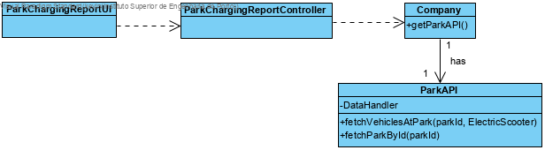

**Description**

In this use case, the administrator can obtain a report stating the charging status for each vehicle in a park and an estimate projection for how long it would take for each vehicle to reach 100% charge under the existing circumstances. 

## 2.2.21. Retrieve invoice for month

The invoices being issued are relative to the trips made during the given month.
However, initially, we supposed that the invoices being issued were for the trips from the month prior to the one specified. 
Example: The user requests an invoice to be issued for month 5. The application would issue the invoice relative to the trips that happened in month 4.
Reasoning: Realistically, invoices issued on month 5 are relative to the trips that happened during month 4. In other words, in month 5 you pay for month 4.
On the other hand, the last test scenario provided seemed to expect the trips that happened in the same month, since otherwise the invoice wouldn't be associated to any trip.
It was decided that we would opt to have optimal results in the scenario.
To achieve this, following piece of code was removed from InvoiceAPI.issueInvoice:

    if (month == 1)
        month = 12;
    else
        month--;
